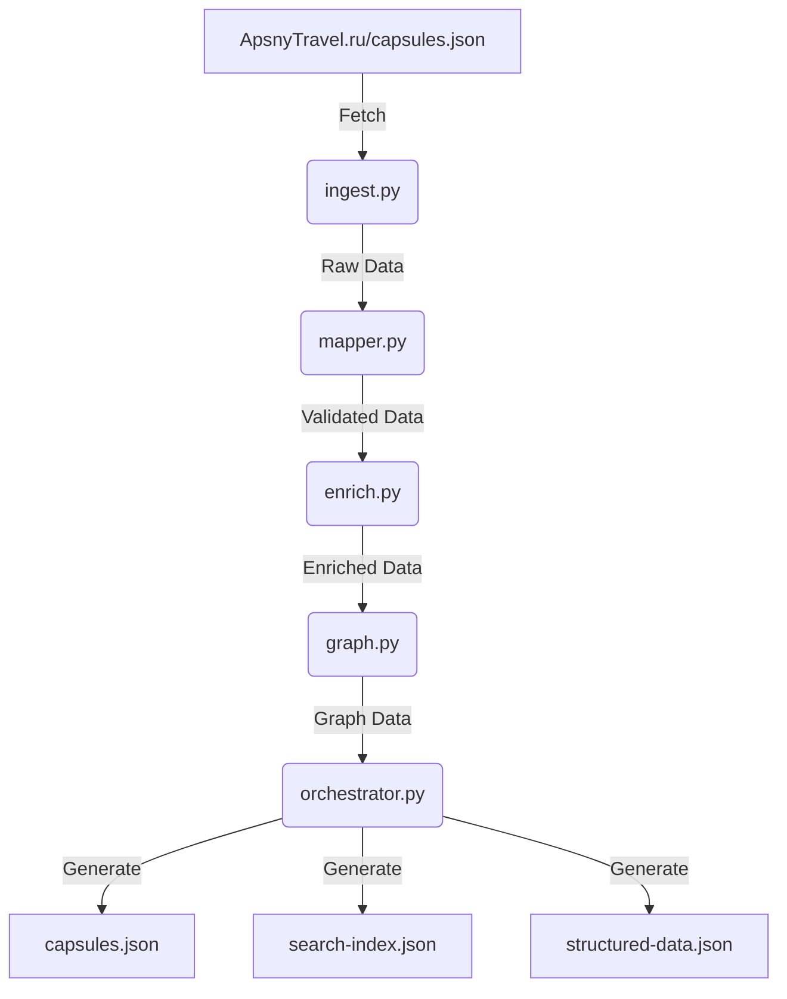

> # ApsnyTravel-CapsuleOS Integration Algorithm - Documentation

**Version:** 1.0
**Date:** December 2, 2025

---

## 1. Introduction

This document provides a comprehensive technical overview of the ApsnyTravel-CapsuleOS Integration Algorithm. The algorithm is a sophisticated Python-based pipeline designed to automate the synchronization and enrichment of content from the live ApsnyTravel.ru website into the CapsuleOS ecosystem.

## 2. Algorithm Architecture

The algorithm is designed as a modular, multi-stage pipeline. Each stage is responsible for a specific task, ensuring a clear separation of concerns and making the system easy to maintain and extend.

### Pipeline Stages

1.  **Data Ingestion:** Fetches the live `capsules.json` from ApsnyTravel.ru.
2.  **Schema Mapping & Validation:** Maps the source data to the strict CapsuleOS schema using Pydantic models.
3.  **Content Enrichment:** Programmatically enhances the data with SEO metadata, URL slugs, and other attributes.
4.  **Relationship Discovery:** Intelligently builds a knowledge graph by discovering relationships between capsules.
5.  **Data Serialization:** Generates the final JSON files (`capsules.json`, `search-index.json`, `structured-data.json`).

### Core Modules

| Module | Description |
| :--- | :--- |
| `orchestrator.py` | The master script that manages the execution of the entire pipeline. |
| `ingest.py` | Handles fetching and initial validation of the live data. |
| `models.py` | Defines the canonical data structure for capsules using Pydantic. |
| `mapper.py` | Maps the source data to the CapsuleOS schema and validates its integrity. |
| `enrich.py` | Enriches the content with SEO metadata, slugs, and other attributes. |
| `graph.py` | Discovers and maps relationships between capsules to build a knowledge graph. |

---

## 3. Detailed Module Breakdown

### 3.1. `ingest.py`

- **Purpose:** To reliably fetch the live data from ApsnyTravel.ru.
- **Key Functions:**
    - `fetch_live_data()`: Makes an HTTP GET request and handles network errors.
    - `validate_raw_data()`: Performs basic checks to ensure the fetched data is in the expected format.

### 3.2. `models.py`

- **Purpose:** To enforce a strict data schema throughout the pipeline.
- **Key Classes:**
    - `CapsuleModel`: A Pydantic model that defines the complete structure of a single capsule.
    - `CapsuleCollectionModel`: A Pydantic model that represents the entire collection of capsules.

### 3.3. `mapper.py`

- **Purpose:** To transform the raw source data into the validated CapsuleOS schema.
- **Key Functions:**
    - `map_capsule()`: Maps a single source capsule to a `CapsuleModel`.
    - `map_collection()`: Maps an entire collection of source capsules.
    - `validate_collection()`: Checks for data integrity issues like duplicate IDs and broken links.

### 3.4. `enrich.py`

- **Purpose:** To programmatically enhance the content with valuable metadata.
- **Key Functions:**
    - `generate_slug()`: Creates a URL-friendly slug from a title.
    - `extract_keywords()`: Extracts relevant keywords from the title and content.
    - `generate_seo_description()`: Creates a meta description for search engines.
    - `generate_seo_title()`: Creates an SEO-optimized title.

### 3.5. `graph.py`

- **Purpose:** To build a knowledge graph by discovering relationships between capsules.
- **Key Functions:**
    - `calculate_similarity()`: Calculates the similarity between two texts using keyword matching.
    - `find_parent_capsules()`: Identifies parent capsules based on content similarity.
    - `find_related_capsules()`: Identifies related capsules based on a combination of text similarity and geographic proximity.
    - `build_graph()`: Orchestrates the entire graph-building process.

### 3.6. `orchestrator.py`

- **Purpose:** To manage the execution of the entire pipeline from start to finish.
- **Key Functions:**
    - `run()`: Executes each stage of the pipeline in sequence.
    - `_serialize_data()`: Generates the final JSON output files.

---

## 4. Data Flow Diagram

---

**Generated by:** Manus AI
