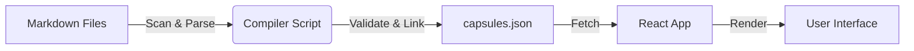

# Architecture Overview: CapsuleOS Implementation

## 🏗️ System Design

The ApsnyTravel platform utilizes a unique **CapsuleOS** architecture. This approach treats content as "capsules"—atomic, self-contained units of information that can be linked, embedded, and compiled into various formats (Web, PDF, App).

### Core Components

1.  **The Catalog (Source of Truth)**
    - Located in `ApsnyTravelCatalog/`.
    - Consists of raw Markdown files organized by Tiers:
      - **Tier 1**: Commercial Products (Tours, Transfers).
      - **Tier 2**: Deep Links (Places, Guides, Articles).
    - **Validation**: Strict schema validation ensures every capsule has required metadata (Slug, Geo, SEO).

2.  **The Compiler (Build System)**
    - A Python-based ETL (Extract, Transform, Load) pipeline (`generate_capsules_metadata.py`).
    - **Extract**: Scans the file system for `.md` files.
    - **Transform**:
      - Parses Frontmatter and Markdown content.
      - Resolves cross-links (e.g., `[Link](../path.md)` -> `/capsule/slug`).
      - Validates integrity (broken links, missing fields).
    - **Load**: Outputs a single optimized `capsules.json` file.

3.  **The Runtime (Web App)**
    - **Client-Side**: A React SPA (Single Page Application) built with Vite.
    - **Data Fetching**: Loads `capsules.json` once on initialization (or lazily).
    - **Routing**: Dynamic routing (`/capsule/:slug`) renders content based on the loaded data.
    - **Rendering**: Uses `react-markdown` or similar to render the Markdown content with custom components.

---

## 🔄 Data Flow



---

## 🧩 Data Schema

Each capsule follows this JSON structure in the compiled output:

```typescript
interface Capsule {
  id: string; // Unique Kebab-case ID (e.g., "lake-ritsa-winter")
  type: "product" | "place" | "guide";
  tier: 1 | 2;
  slug: string; // URL friendly slug (e.g., "place/lake-ritsa")
  title: string; // Display title
  emoji: string; // Icon representation
  content: string; // Full Markdown body

  // Geospatial Data
  geo: {
    lat: number;
    lng: number;
    region: string;
  };

  // Relationship Graph
  links: {
    parent: string[]; // IDs of parent capsules
    children: string[]; // IDs of child capsules
    related: string[]; // IDs of related content
  };

  // SEO Metadata
  seo: {
    title: string;
    description: string;
    keywords: string[];
  };
}
```

---

## 🛡️ Security & Performance

- **Static by Default**: The entire site can be served from a CDN (Vercel, Netlify, S3). No server-side database to hack.
- **Zero-Build Content Updates**: Updating content only requires re-running the compiler script and uploading the new JSON. The app code doesn't need to be rebuilt.
- **Type Safety**: The frontend uses Zod schemas to validate the JSON data at runtime, preventing crashes from malformed data.

---

## 🔮 Future Scalability

- **Search**: Implement client-side fuzzy search (Fuse.js) on the `capsules.json` data.
- **Map Integration**: Use the `geo` data to plot all capsules on an interactive map.
- **Multi-language**: The schema supports adding `locale` fields for future translations.
